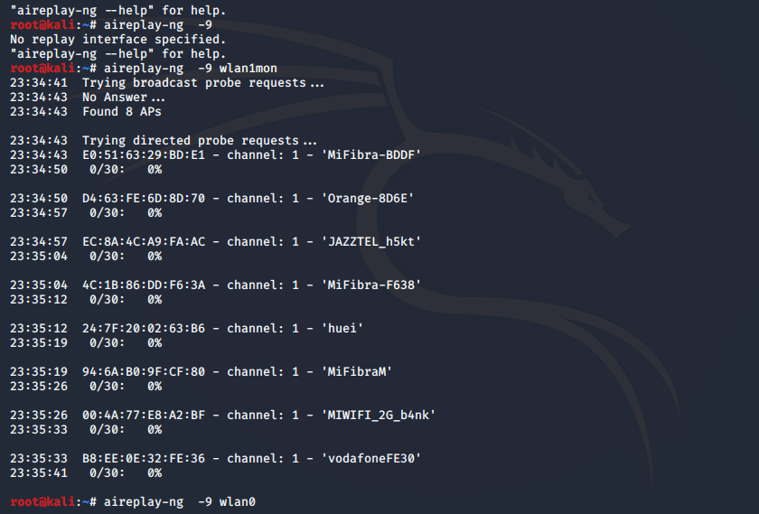
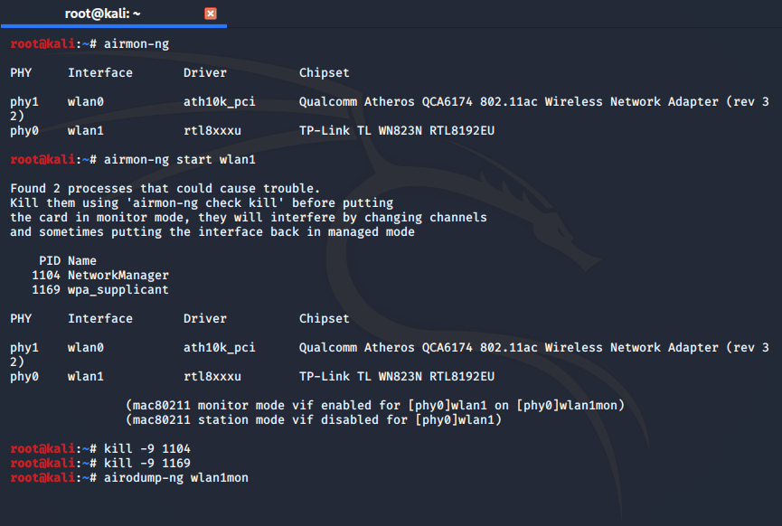
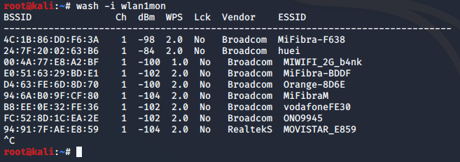
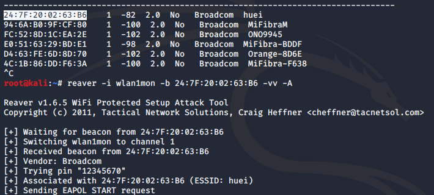

# hack-wifi WPA/2 con WPS

En la actividad anterior hemos conseguido descifrar las claves de red wifi con cifrado WPA a fuerza bruta, y eso dependiendo la situación pueden ser muy costosa. Vamos a probar otro manera basada en una vulnerabilidad del funcionameinto WPS. El WPS nos ayuda a conectar distintos dispositivos de red pulsando el botón WPS para emparejarlo. Normalmente usan un pin de 4 u 8 carácteres, y eso es fácil de descifrar.

## Tener en cuenta:
Para este práctica necesitamos una tarjeta de red que soporta inyección de paquetes. Podemos comprobar con el comando **aireplay**:
>aireplay -9 wlan1mon


Si envias el paquetes muy frecunete puede probocar que el router se deshabilite (como un ataque DDoS).


Mi tarjeta de red no soporta inyección de paquetes, no puedo usar este método para conseguir las claves wifi. Pero podemos empezar la ataque, los pasos que hay que seguir son siguientes:



Una vez comprobado tu tarjeta de red soporta inyección de paquetes abrimos el terminal y hacemos los 4º primeros pasos del práctica [Hackear wifi wep](https://nswhuei.github.io/hack-wifi/ActividadRQ3.1).




Usamos el comando **wash** para filtrar los wifi con WPS habilitado. 
>wash -i wlan1mon



Por lo último ejecutamos el comando **reaver**, viene preinstalado en Kali. Y esperamos que se termine de encontrar la clave.

>reaver -i wlan1mon -b 24:7F:20:02:63:B6 -v

```-i``` Interfaz del wlan.

```-b``` BSSID del router.

```-v``` Te indica cada paso lo que está haciendo.

Como podéis ver "hackear" red wifi con WPS es bastante más sencillo intentando descifrar la clave con un diccionario a fuerza. Si no vas a usar WPS, deshabilitalo.

[Volver al Página de inicio](https://nswhuei.github.io/hack-wifi/)
